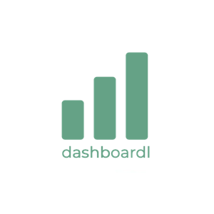

<a name="readme-top"></a>

HOW TO USE:
This is an example of how you may give instructions on setting up your project locally.

Modify this file to match your project and remove sections that don't apply.

<!--TABLE OF CONTENTS -->

- Table of Contents
- About the Project
  - Built With
  - Live Demo
- Getting Started
- Authors
- Future Features
- Contributing
- Show your support
- Acknowledgements
- License

OPTIONAL SECTIONS:
- FAQ

After you're finished please remove all the comments and instructions!
-->

<div align="center">
  <!-- You are encouraged to replace this logo with your own! Otherwise you can also remove it. -->
  
  <br/>

  <h3><b>User Dashboard Project</b></h3>

</div>

<!-- TABLE OF CONTENTS -->

# 📗 Table of Contents

- [📗 Table of Contents](#-table-of-contents)
- [📖 User Dashboard Project ](#-user-dashboard-project-)
  - [🛠 Built With ](#-built-with-)
    - [Tech Stack ](#tech-stack-)
    - [Key Features ](#key-features-)
  - [🚀 Live Demo ](#-live-demo-)
  - [💻 Getting Started ](#-getting-started-)
    - [Prerequisites](#prerequisites)
    - [Setup](#setup)
    - [Install](#install)
    - [Usage](#usage)
    - [Run tests](#run-tests)
    - [Deployment](#deployment)
  - [👥 Authors ](#-authors-)
  - [🔭 Future Features ](#-future-features-)
  - [🤝 Contributing ](#-contributing-)
  - [⭐️ Show your support ](#️-show-your-support-)
  - [🙏 Acknowledgments ](#-acknowledgments-)
  - [📝 License ](#-license-)

<!-- PROJECT DESCRIPTION -->

# 📖 User Dashboard Project <a name="about-project"></a>


**User Dashboard Project** graphical interface within a software application that centralizes and displays relevant information and tools tailored to a user's specific needs and activities.

## 🛠 Built With <a name="built-with"></a>

### Tech Stack <a name="tech-stack"></a>


<details>
  <summary>Front-end</summary>
  <ul>
    <li>React Next Js </li>
  </ul>
</details>


<!-- Features -->

### Key Features <a name="key-features"></a>

- **Provides a consolidated view of critical data and key performance indicators**
- **Offers personalized user insights and actionable recommendations**
- **Facilitates easy navigation to important functionalities and tasks within the application**

<p align="right">(<a href="#readme-top">back to top</a>)</p>


## 🚀 Live Demo <a name="live-demo"></a>

- [Live Demo Link](https://usrsdashboard.netlify.app/)

<p align="right">(<a href="#readme-top">back to top</a>)</p>


<!-- GETTING STARTED -->

## 💻 Getting Started <a name="getting-started"></a>

To get a local copy up and running, follow these steps.

### Prerequisites

In order to run this project you need:

<!--
Example command:

```sh
 gem install rails
```
 -->
 <ul>
    <li>Installation of Git</li>
    <li>Installation of NPM</li>
    <li>A working browser</li>
    <li> Next Js</li>
    <li>Internet connection</li>
    <li>A code editor like Visual Studio Code</li>
  </ul>

### Setup

Clone this repository to your desired folder:


```sh
  cd my-folder
 (https://github.com/bdshakhawat/user-dashboard.git)
```

### Install

Install this project with:

<ul>
  <li>npm install</li>
  <li>Node</li>
  <li>Linters (follow this link's instruction <a href="https://github.com/microverseinc/linters-config">install linter</a>)</li>
</ul>

### Usage

To run the project, use  ```npm run dev``` command.

<!--
Example command:

```sh
  rails server
```
--->

### Run tests

Test case will be added soon.
<!--
Example command:

```sh
  bin/rails test test/models/article_test.rb
```
--->

### Deployment

Deployment instruction will be added soon
<!--
Example:

```sh

```
 -->

<p align="right">(<a href="#readme-top">back to top</a>)</p>

<!-- AUTHORS -->

## 👥 Authors <a name="authors"></a>


👤 **Author1**

- GitHub: [@bdshakhawat](https://github.com/bdshakhawat)
- Twitter: [@bdshakwat](https://twitter.com/bdshakwat)
- LinkedIn: [shakawat-hossain](https://www.linkedin.com/in/shakawat-hossain)

<p align="right">(<a href="#readme-top">back to top</a>)</p>

<!-- FUTURE FEATURES -->

## 🔭 Future Features <a name="future-features"></a>

- **project showcase section**
- **client's feedback**
- **contact section**

<p align="right">(<a href="#readme-top">back to top</a>)</p>

<!-- CONTRIBUTING -->

## 🤝 Contributing <a name="contributing"></a>

Contributions, issues, and feature requests are welcome!

Feel free to check the [issues page](../../issues/).

<p align="right">(<a href="#readme-top">back to top</a>)</p>

<!-- SUPPORT -->

## ⭐️ Show your support <a name="support"></a>

If you like this project please send a welcome message on Twitter and let's have a chat to share coding knowledge.

<p align="right">(<a href="#readme-top">back to top</a>)</p>

<!-- ACKNOWLEDGEMENTS -->

## 🙏 Acknowledgments <a name="acknowledgements"></a>

I would like to thank my wife, who always inspires me to be a better software engineer. Also thanks to Microverse for awesome support.

<p align="right">(<a href="#readme-top">back to top</a>)</p>

<!-- LICENSE -->

## 📝 License <a name="license"></a>

This project is [MIT](./LICENSE) licensed.

<p align="right">(<a href="#readme-top">back to top</a>)</p>


